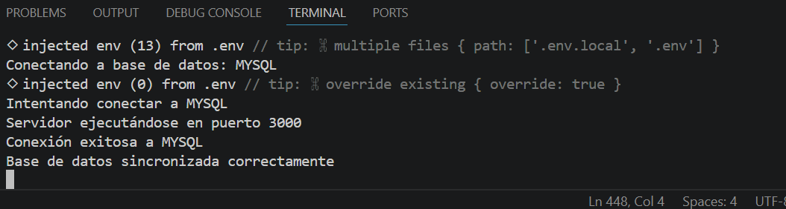
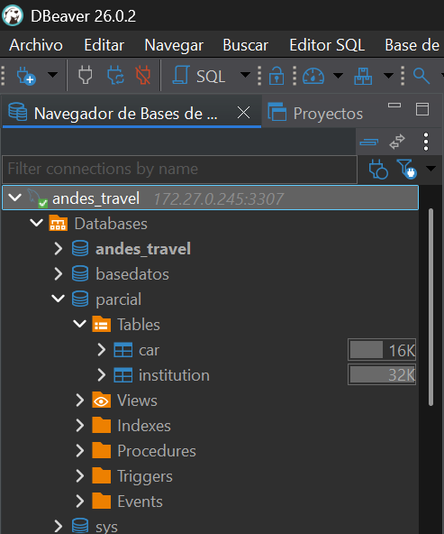
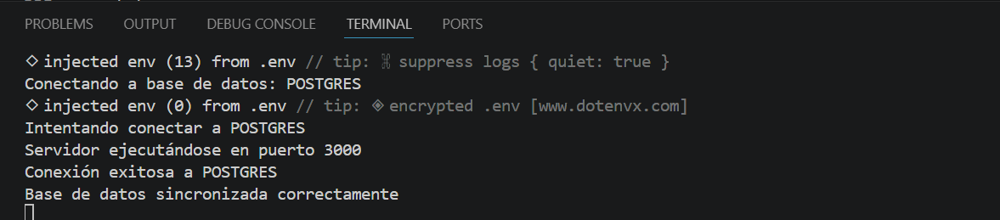
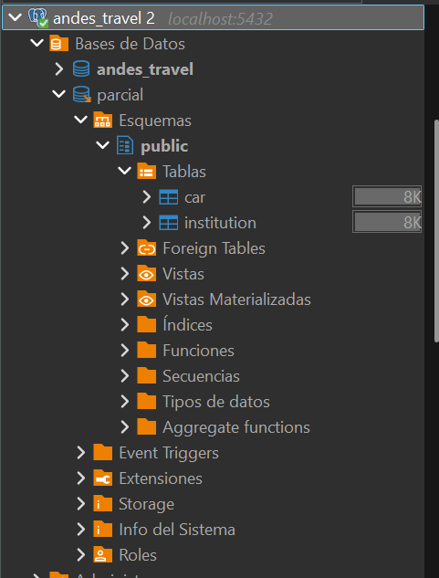

# Informe de Desarrollo de Modelos con Node.js y Sequelize

## Integrantes

* Nombre: Cristian Cardenas
* Código: 0182210012
* Curso: Desarrollo web
* Fecha: 13/05/2026

---

# 1. Introducción

En este proyecto se desarrolló una API utilizando Node.js, TypeScript y Sequelize ORM, compatible con los motores de base de datos MySQL y PostgreSQL. Se implementaron modelos con validaciones, relaciones y manejo de borrado lógico mediante el campo `status`.

Además, se configuró la conexión a base de datos, la estructura de carpetas del proyecto y la sincronización automática de tablas mediante Sequelize.

---

# 2. Objetivos

## 2.1 Objetivo General

Desarrollar modelos funcionales utilizando Sequelize ORM compatibles con múltiples motores de base de datos.

## 2.2 Objetivos Específicos

* Configurar Sequelize con Node.js y TypeScript.
* Implementar modelos con validaciones.
* Crear relaciones entre tablas.
* Implementar borrado lógico mediante el campo `status`.
* Crear compatibilidad con MySQL y PostgreSQL.
* Probar el funcionamiento de los modelos y relaciones.

---

# 3. Tecnologías Utilizadas

| Tecnología | Descripción                        |
| ---------- | ---------------------------------- |
| Node.js    | Entorno de ejecución de JavaScript |
| TypeScript | Superset tipado de JavaScript      |
| Sequelize  | ORM para bases de datos SQL        |
| MySQL      | Motor de base de datos             |
| PostgreSQL | Motor de base de datos             |
| Express    | Framework para APIs                |
| dotenv     | Manejo de variables de entorno     |

---

# 4. Creación de la Base de Datos

Se crearon las tablas necesarias para el proyecto:

## Tabla `car`

```sql
CREATE TABLE car (
      id NUMBER GENERATED BY DEFAULT AS IDENTITY PRIMARY KEY,
      marca VARCHAR2(50) NOT NULL,
      clase VARCHAR2(50) NOT NULL,
      modelo VARCHAR2(255) NOT NULL,
      cilindraje VARCHAR2(50) NOT NULL,
      capacidad VARCHAR2(50) NOT NULL
);
```

## Tabla `institucion`

```sql
CREATE TABLE institucion (
      institucion_id NUMBER GENERATED BY DEFAULT AS IDENTITY PRIMARY KEY,
      date_matricula VARCHAR2(50) NOT NULL,
      ciudad VARCHAR2(50) NOT NULL,
      pago VARCHAR2(255) NOT NULL,
      car_id VARCHAR2(50) NOT NULL,
      FOREIGN KEY (car_id) REFERENCES car(id)
);
```

---

# 5. Configuración de la Base de Datos

Se configuró Sequelize para soportar MySQL y PostgreSQL utilizando variables de entorno.

## Captura de Configuración

<!-- INSERTAR CAPTURA AQUÍ -->

---

# 6. Creación del Modelo Car

Se desarrolló el modelo `Car` utilizando Sequelize y TypeScript.

## Características Implementadas

* Validaciones.
* Restricciones.
* Hooks.
* Campo `status`.
* Relación uno a muchos.

## Código Implementado

```ts
import { DataTypes, Model } from "sequelize";
import { sequelize } from "../../database/db";
import { Institution } from "./Institution";

export interface CarI {
  id?: number;
  brand: string;
  class: string;
  model: string;
  cylinder_capacity: string;
  capacity: string;
  status: "ACTIVE" | "INACTIVE";
}

export class Car extends Model<CarI> implements CarI {
  public id!: number;
  public brand!: string;
  public class!: string;
  public model!: string;
  public cylinder_capacity!: string;
  public capacity!: string;
  public status!: "ACTIVE" | "INACTIVE";
}

Car.init(
  {
    id: {
      type: DataTypes.INTEGER,
      primaryKey: true,
      autoIncrement: true,

      validate: {
        isInt: {
          msg: "Id must be integer",
        },
      },
    },

    brand: {
      type: DataTypes.STRING(50),
      allowNull: false,

      validate: {
        notEmpty: {
          msg: "Brand is required",
        },

        len: {
          args: [2, 50],
          msg: "Brand must contain between 2 and 50 characters",
        },
      },
    },

    class: {
      type: DataTypes.STRING(50),
      allowNull: false,

      validate: {
        notEmpty: {
          msg: "Class is required",
        },

        len: {
          args: [2, 50],
          msg: "Class must contain between 2 and 50 characters",
        },
      },
    },

    model: {
      type: DataTypes.STRING(255),
      allowNull: false,

      validate: {
        notEmpty: {
          msg: "Model is required",
        },
      },
    },

    cylinder_capacity: {
      type: DataTypes.STRING(50),
      allowNull: false,

      validate: {
        notEmpty: {
          msg: "Cylinder capacity is required",
        },
      },
    },

    capacity: {
      type: DataTypes.STRING(50),
      allowNull: false,

      validate: {
        notEmpty: {
          msg: "Capacity is required",
        },
      },
    },

    status: {
      type: DataTypes.ENUM("ACTIVE", "INACTIVE"),
      defaultValue: "ACTIVE",

      validate: {
        isIn: {
          args: [["ACTIVE", "INACTIVE"]],
          msg: "Status must be ACTIVE or INACTIVE",
        },
      },
    },
  },
  {
    sequelize,
    modelName: "Car",
    tableName: "car",
    timestamps: false,

    hooks: {
      beforeCreate: async (car: Car) => {
        console.log("Creating car...");
      },

      beforeUpdate: async (car: Car) => {
        console.log("Updating car...");
      },
    },
  }
);
```

---

# 7. Creación del Modelo Institution

Se desarrolló el modelo `Institution` relacionado con el modelo `Car`.

## Características Implementadas

* Llave foránea.
* Validaciones.
* Campo `status`.
* Relación belongsTo.

## Código Implementado

```ts
import { DataTypes, Model } from "sequelize";
import { sequelize } from "../../database/db";
import { Car } from "./Car";

export interface InstitutionI {
  institution_id?: number;
  registration_date: string;
  city: string;
  payment: string;
  car_id: number;
  status: "ACTIVE" | "INACTIVE";
}

export class Institution
  extends Model<InstitutionI>
  implements InstitutionI
{
  public institution_id!: number;
  public registration_date!: string;
  public city!: string;
  public payment!: string;
  public car_id!: number;
  public status!: "ACTIVE" | "INACTIVE";
}

Institution.init(
  {
    institution_id: {
      type: DataTypes.INTEGER,
      primaryKey: true,
      autoIncrement: true,

      validate: {
        isInt: {
          msg: "Institution ID must be integer",
        },
      },
    },

    registration_date: {
      type: DataTypes.STRING(50),
      allowNull: false,

      validate: {
        notEmpty: {
          msg: "Registration date is required",
        },
      },
    },

    city: {
      type: DataTypes.STRING(50),
      allowNull: false,

      validate: {
        notEmpty: {
          msg: "City is required",
        },

        len: {
          args: [2, 50],
          msg: "City must contain between 2 and 50 characters",
        },
      },
    },

    payment: {
      type: DataTypes.STRING(255),
      allowNull: false,

      validate: {
        notEmpty: {
          msg: "Payment is required",
        },
      },
    },

    car_id: {
      type: DataTypes.INTEGER,
      allowNull: false,

      references: {
        model: "car",
        key: "id",
      },

      validate: {
        isInt: {
          msg: "Car ID must be integer",
        },
      },
    },

    status: {
      type: DataTypes.ENUM("ACTIVE", "INACTIVE"),
      defaultValue: "ACTIVE",

      validate: {
        isIn: {
          args: [["ACTIVE", "INACTIVE"]],
          msg: "Status must be ACTIVE or INACTIVE",
        },
      },
    },
  },
  {
    sequelize,
    modelName: "Institution",
    tableName: "institution",
    timestamps: false,

    hooks: {
      beforeCreate: async (institution: Institution) => {
        console.log("Creating institution...");
      },

      beforeUpdate: async (institution: Institution) => {
        console.log("Updating institution...");
      },
    },
  }
);
```

---

# 8. Relaciones Entre Modelos

Inicialmente las relaciones fueron implementadas directamente dentro de los modelos `Car` e `Institution`. Sin embargo, al ejecutar el proyecto se presentó un error de relación circular en Sequelize:

```txt
Institution.belongsTo called with something that's not a subclass of Sequelize.Model
```

Este error ocurrió porque ambos modelos se importaban mutuamente antes de terminar su inicialización.

Para solucionar este problema, se creó un archivo independiente llamado:

```txt
src/models/business/index.ts
```

En este archivo se centralizaron las relaciones entre modelos.

## Relación Implementada

```ts
import { Car } from "./Car";
import { Institution } from "./Institution";

Car.hasMany(Institution, {
  foreignKey: "car_id",
  as: "institutions",
});

Institution.belongsTo(Car, {
  foreignKey: "car_id",
  as: "car",
});
```

Posteriormente se importó únicamente el archivo `index.ts` de los modelos para evitar dependencias circulares.

## Importación Correcta

```ts
import "../models/business";
```

# 9. Validaciones Implementadas

Se implementaron validaciones para asegurar la integridad de los datos.

## Validaciones Utilizadas

* `notEmpty`
* `len`
* `isInt`
* `isIn`

## Ejemplo

```ts
validate: {
  notEmpty: {
    msg: "Brand is required",
  },
}
```
# 10. Implementación de Hooks

Se implementaron hooks para detectar eventos antes de crear o actualizar registros.

## Hooks Utilizados

```ts
hooks: {
  beforeCreate: async () => {
    console.log("Creating...");
  },

  beforeUpdate: async () => {
    console.log("Updating...");
  },
}
```

# 11. Manejo de Estado Lógico

Se implementó un campo `status` para manejar borrado lógico.

## Valores Permitidos

* ACTIVE
* INACTIVE

## Ejemplo

```ts
status: {
  type: DataTypes.ENUM("ACTIVE", "INACTIVE"),
  defaultValue: "ACTIVE",
}
```


# 12. Ejecución del Proyecto

Para ejecutar el proyecto se utilizaron los siguientes comandos:

```bash
npm install
npm run build
npm run dev
```

Al iniciar el servidor, Sequelize realizó automáticamente:

* La conexión a la base de datos.
* La validación de conexión.
* La sincronización automática de tablas.
* La creación de las tablas `car` e `institution`.

Esto fue posible gracias al método:

```ts
await sequelize.sync({
  force: false,
});
```

Implementado dentro de:

```txt
src/config/index.ts
```

También fue necesario importar correctamente los modelos:

```ts
import "../models/business";
```

## Captura de Ejecución

<!-- INSERTAR CAPTURA AQUÍ -->

---

# 13. Resultados Obtenidos

Se logró:

* Crear modelos funcionales.
* Implementar relaciones entre tablas.
* Configurar Sequelize correctamente.
* Ejecutar la sincronización automática.
* Validar datos correctamente.
* Implementar borrado lógico.

## Captura de Resultados

Ejecucion con MySQL




Ejecucion con Postgres:



---


---

